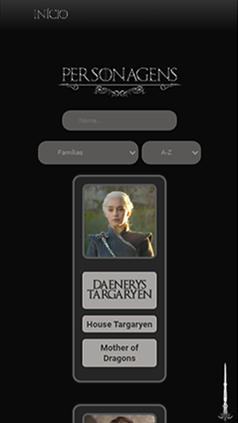
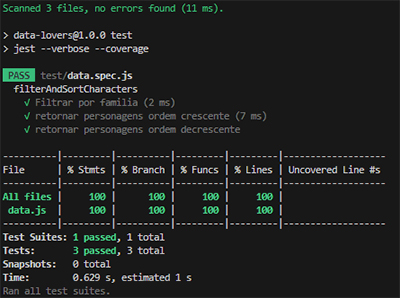

# Data Lovers - GOT

## Índice

* [1. Introdução](#1-introdução)
* [2. Resumo do projeto](#2-resumo-do-projeto)
* [3. Definição do produto](#3-definição-do-produto)
* [4. Testes unitários](#4-testes-unitários)

***

## 1. Introdução

Projeto desenvolvido de acordo com a proposta do Bootcamp - Laboratória, onde o objetivo é escoher um tema proposto e desenvolver uma página web que permita visualizar dados, filtrá-los e ordená-los.
O objetivo principal deste projeto é que aprenda a desenhar e construir uma interface web onde se possa visualizar e manipular dados, entendendo o que o usuário necessita.

### HTML
- Uso de HTML semântico
### CSS
- Uso de seletores de CSS
- Modelo de caixa (box model): borda, margem, preenchimento
- Uso de flexbox em CSS
### Web APIs
- Uso de seletores de DOM
- Manipulação de eventos de DOM (listeners, propagação, delegação)
- Manipulação dinâmica de DOM
### JavaScript
- Diferenciar entre tipos de dados primitivos e não primitivos
- Arrays (arranjos)
- Objetos (key, value)
- Variáveis (declaração, atribuição, escopo)
- Uso de condicionais (if-else, switch, operador ternário, lógica booleana)
- Uso de laços (while, for, for..of)
- Funções (params, args, return)
- Testes unitários (unit tests)
- Módulos de ECMAScript (ES modules)
- Uso de linter (ESLINT)
- Uso de identificadores descritivos (Nomenclatura e Semântica)
- Diferença entre expressões (expressions) e declarações (statements)
### Controle de Versões (Git e GitHub)
- Git: Instalação e configuração
- Git: Controle de versão com git (init, clone, add, commit, status, push, pull, remote)
- Git: Integração de mudanças entre ramos (branch, checkout, fetch, merge, reset, rebase, tag)
- GitHub: Criação de contas e repositórios, configuração de chave SSH
- GitHub: Implantação com GitHub Pages
- GitHub: Colaboração pelo Github (branches | forks | pull requests | code review | tags)
### Centrado no usuário
- Desenhar e desenvolver um produto ou serviço colocando as usuárias no centro
### Design de produto
- Criar protótipos para obter feedback e iterar
- Aplicar os princípios de desenho visual (contraste, alinhamento, hierarquia)
### Pesquisa
- Planejar e executar testes de usabilidade

***

## 2. Resumo do projeto

O site foi desenvolvido utilizando (HTML, CSS e JavaScript), são três páginas, Sobre, Buscar e Assistir, conforme abaixo:

Implementada a funcionalidade de filtrar por Nome, Família e Ordem crescente e decrescente.

O usuário pode acessar o aplicativo através deste link: [Data Lovers - GOT](https://febbex.github.io/SAP011-data-lovers/). 

### Interface de Usuário - Responsiva

* Páginas Versão Mobile

***

## 3. Definição do produto

Reflita e depois enumere os objetivos que quer alcançar e aplique no seu projeto. Pense nisso para decidir sua estratégia de trabalho.

### História do usuário 

# Game of Thrones

"Game of Thrones" é uma série dramática de televisão e
fantasia épica criada por David Benioff e D.B. Weiss,
Baseado na série de romances "As Crônicas de Gelo e Fogo"
do autor George R. R. Martin. A série acompanha as lutas e
conflitos entre várias casas nobres no continente fictício
de Westeros, enquanto competem pelo Trono de Ferro e pelo
controle dos Sete Reinos.

## Detalhes dos data

- nome
- sobrenome
- qualificação
- família
- imagem
- ano de nascimento
- ano da morte

## Constatações

Fazendo pesquisas sobre
informações que nosso
usuários, descobrimos que os dados com maior
interesse são:

- Informações sobre os personagens como nome,
casa/família.

Além dessas informações, é importante que nossos usuários possam ver a
lista de personagens com imagem, nome, casa e titúlo de cada um.

- [ ] **Protótipo de média fidelidade**

  

Links

  * [Interface - idéia inicial](https://dataloversgot.my.canva.site/)

## Testes de usabilidade

### Após alguns testes de usabilidade foi ajustado: 

* Disposição do texto para cada tipo de tela.
* Incluído um icone para facilitar voltar ao topo da página.
* Botão Início, para voltar a página inicial.

***

## 4. Testes unitários

Teste aplicado nas funções, selecionar por familia e ordenações.

